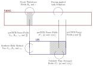
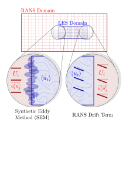

# Embedded LES

This repository contains the code used for an Embedded LES framework based on OpenFOAM.

## Method

Embedded LES refers to the automatic switching to scale resolving simulation. The current method implemnts a nested procedure where the whole domain is covered by a RANS mesh and within this there is an area/areas of LES. This is done by coupling a standard openFOAM RANS solver with a standard OpenFOAM LES solver. The interfacing between the two solvers is handled by [preCICE](https://precice.org/), an open-source coupling library for partitioned multi-physics simulations and uses a [modified version](https://github.com/cfdemons/preCICE-openfoam-adapter/tree/SEM-redo) of the standard openFoam adapter.

+ [mySEM](https://github.com/admole/myELES/tree/inout/mySEM) is a boundary condition for the velocity in the LES region that reads in the velocity from the RANS mesh and applies the Synthetic Eddy Method to generate the turbulent structures. [more info](./mySEM/README.md)

+ [myOutletInlet](https://github.com/admole/myELES/tree/inout/myOutletInlet) is a boundary condition for the pressure in the LES region that reads pressure and pressure gradient from the RANS mesh and applies one depending on the flow direction.

+ [myCorrection](https://github.com/admole/myELES/tree/inout/myCorrection) is a source term is called by fvOptions in order to apply a drift force to correct the RANS towards the LES in a specified region.





## Compilation

This code has been tested in OpenFOAMv1806. To install:

```bash
cd mySEM;
wmake;
cd ../myOutletInlet;
wmake;
cd ../myCorrection;
wmake;
cd ../
```


